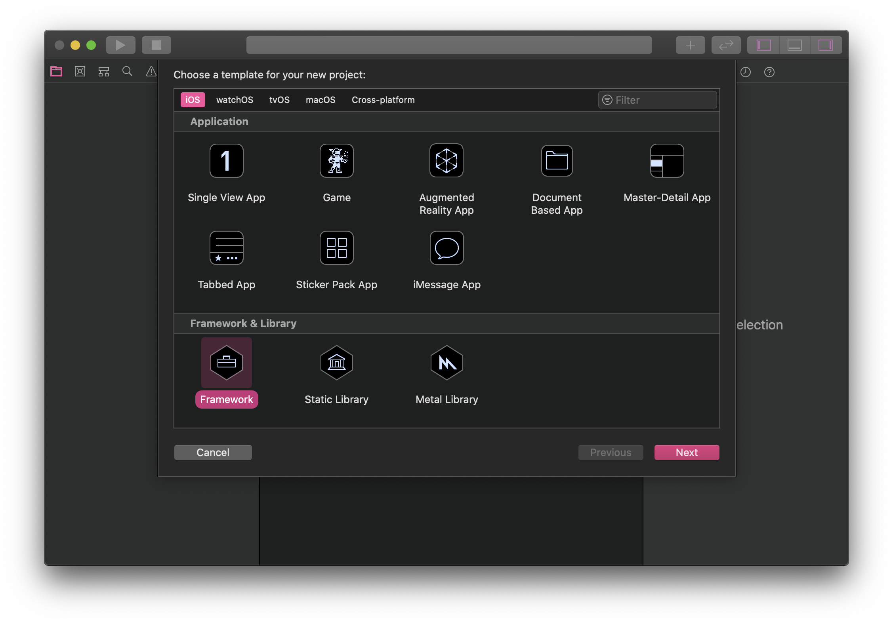
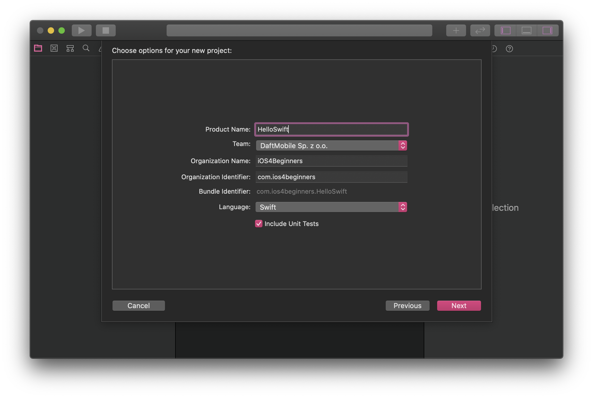

### Assignment #1

# HelloSwift

### Opis zadania

Celem zadania jest stworzenie trzech klas wykonujących proste funkcje. Dzięki temu zadaniu poznasz lepiej składnię Swifta, oraz nauczysz się tworzyć proste klasy typu *Util*. Nauczysz się też podstaw obsługi *XCode*, oraz procesu uruchamiania testów jednostkowych.

#### Math Tools

Pierwszą klasą jest klasa `MathTool`. Klasa ta posiada jedną metodę, której zadaniem jest policzenie wartości ciągu Fibonacciego dla podanego argumentu. Przykładowe wywołania dla tego klasy mają wyglądać w ten sposób:

```swift
let math = MathTools()
print(math.fibonacci(10))
// prints: 55
```

---

#### String Tools

Drugą klasą jest klasa `StringTools`. W tej klasie stworzymy jedną funkcję, która liczy ilość wystąpień podanego znaku w przekazanym `String`u. Przykładowe użycie mamy poniżej:

```swift
let stringTools = StringTools()
let count = stringTools.countOccurences(character: "i", from: "Hello. My name is Michał.")
print(count)
// prints: 2
```

Klasa `StringTools` obsługuje dwie wersje podanej funkcji. Może zliczać wystąpienia zarówno z uwzględnieniem wielkości znaków, jak i w trybie case-insensitive. Parametr `caseSensitive` jest ostatnim parametrem funkcji, który **domyślnie** ma wartość `true`. Poniżej przykładowe wywołanie z użyciem parametru.

```swift
print(StringTools().countOccurences(character: "h", from: "Hello. My name is Michał.", caseSensitive: true))
// prints: 1

print(StringTools().countOccurences(character: "h", from: "Hello. My name is Michał.", caseSensitive: false))
// prints: 2
```

---

#### Factorization

Kolejne zadanie polega na stworzeniu klasy sprawdzającej czy podana liczba jest liczbą pierwszą, czy złożoną. Do tego celu wykorzystamy swiftowe `enum`y. Chcemy żeby wywołanie naszej klasy wyglądało w ten sposób:

```swift
let result = Factorization.factorize(5)
print(result == .prime)
// prints: true
```

Jak widać w powyższego `print`u – metoda `factorize` zwraca `Optional<Result>`, czyli `Result?`. Dlaczego wykorzystaliśmy typ `Optional`? Niektóre liczby całkowite nie kwalifikują się ani jako pierwsze, ani jako złożone. Wtedy chcemy, żeby funkcja zwróciła `nil`.

W przypadku liczby złożonej funkcja `factorize` zwraca inną opcję z enuma `Result`. Ta opcja zawiera **associated value** będące tablicą dzielników (ułożone niemalejąco czynniki pierwsze z rozkładu parametru).

```swift
Factorization.factorize(1) == nil
Factorization.factorize(5) == .prime
Factorization.factorize(6) == .composite(factors: [2, 3])
Factorization.factorize(8) == .composite(factors: [2, 2, 2])
Factorization.factorize(2 * 2 * 5 * 11 * 13) == .composite(factors: [2, 2, 5, 11, 13])
```

```
func testFactorsOf1() {
  XCTAssertNil(Factorization.factorize(1))
}

func testFactorsOf2() {
  XCTAssertEqual(Factorization.factorize(2), .prime)
}

func testFactorsOf4() {
  XCTAssertEqual(Factorization.factorize(4), .composite(factors: [2, 2]))
}
```

---

### Wskazówki

1. Po pierwsze stwórz pusty projekt w XCode. Wybierz template **iOS -> Framework**. Nazwij projekt **HelloSwift**. Zanzacz, że **chcesz** stworzyć testy jednostkowe.


2. Stwórz trzy pliki pod odpowiednie klasy (`StringTools.swift`, `MathTools.swift` oraz `Factorization.swift`).
3. Napisz nagłówki funkcji. Przeczytaj odpowiednie informacje o [domyślnych parametrach funkcji](https://docs.swift.org/swift-book/LanguageGuide/Functions.html#ID169).
4. Target który wybrałeś to *biblioteka*. Dlatego nie możesz jej **uruchomić** – możesz jedynie uruchomić testy jednostkowe. Zrób to przy pomocy skrótu klawiaturowego **⌘+U**.
5. Testy jednostkowe, które stworzyłem do zadania pobierz i umieść w projekcie tak, aby móc sprawdzać czy Twoje zadanie się uruchamia i spełnia założenia.
   - [MathToolsTests.swift](assets/MathToolsTests.swift)
   - [StringToolsTests.swift](assets/StringToolsTests.swift)
6. Do zadania 3 nie dołączam testów jednostkowych. Napisałem przykładowe wywołania tych funkcji – wykorzystaj je. Możesz napisać własne testy, ale musisz sobie sam(a) poradzić z ich uruchomieniem.
7. W trzecim zadaniu jako rezultatu użyj odpowiedniego [*enum*](https://docs.swift.org/swift-book/LanguageGuide/Enumerations.html).
8. Pamiętaj, żeby opcji `Result.composite` dać **associated value** – `factors: [Int]`.
9. Typ `Result` umieść jako wewnętrzny typ klasy `Factorization` – taki jest pattern w Swifcie, zamiast tworzyć wiszący enum `FactoriationResult`.
10. Podpowiedź: aby móc porównywać do siebie struktury, musisz oznaczyć conformance do protokołu `Equatable`.
11. Napisz poprawne nagłówek funkcji `factorize`. Użyj funkcji statycznej (obiekt `Factorization` nie ma stanu wewnętrznego).
12. Pamiętaj żeby odpowiednio [skonfigurować git'a](https://help.github.com/en/github/using-git/setting-your-username-in-git).

### Kryteria oceny

1. Poprawnie stworzony projekt typu Framework.
2. Przechodzące wszystkie testy.
3. Styl kodu.
4. Umieszczenie klas w osobnych, poprawnie nazwanych plikach.
5. Poprawnie stworzone repozytorium w projekcie, poprawnie stworzony commit kodu, sensowna historia commitów.

### Odpowiedzi

Odpowiedzi będą automatycznie przyjmowane do końca soboty **16.11.2019, 23:59**. Pamiętaj o pushowaniu swoich commitów!

#### Powodzenia!
